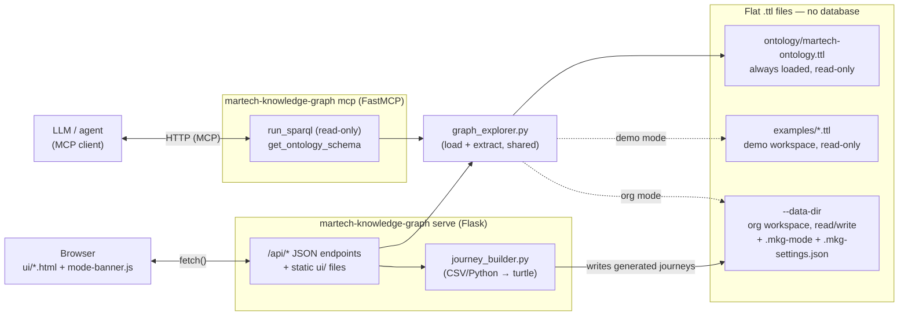

# Unified Martech Knowledge Graph (MVP)

A small, working example of a knowledge graph for martech data — built as an RDFS ontology in Turtle, served through a web UI with a live interactive graph view and a SPARQL query page. This is the companion code for a blog series on modeling business meaning (journeys, KPIs, requirements) alongside technical metadata (XDM components, data layer variables) as one connected graph.

All data in this repo is generic example content (Adobe Experience Platform's public Champion sandbox) — not tied to any specific company.

## Architecture

No database, no build step — flat `.ttl` files are the storage layer, read and written directly by two
small, independent local processes: a Flask app that serves the UI + a JSON API, and a FastMCP server
that exposes the same graph to LLMs/agents:



The demo/org mode switch (top right of every page) changes which of `examples/` or `--data-dir` both
processes read and write — resolved via the shared `workspace.py` (reading the same `.mkg-mode` file) —
see [Web UI](#web-ui) and [MCP server](#mcp-server) below. `ui/WIRING.md` has the detailed, page-by-page
version of the UI half of this diagram: every element ID, every endpoint, and exactly what's wired to
what.

## What's in here

| Path | What it is |
|---|---|
| `pyproject.toml` | Package definition — `pip install .` (or `pip install -e .` for local dev) installs the `martech-knowledge-graph` command |
| `src/martech_knowledge_graph/ontology/martech-ontology.ttl` | The schema: node classes (`Requirement`, `KPI`, `Journey`, `Stage`, `Feature`, `Component`, `DataLayerVariable`) and the predicates connecting them |
| `src/martech_knowledge_graph/examples/*.ttl` | Bundled example journey data (a 4-step ecommerce funnel, a 2-step login flow) — this is the **demo** workspace itself (read-only), toggled on/off with the rest of the UI's data-mode switcher, not copied anywhere |
| `src/martech_knowledge_graph/graph_explorer.py` | Internal library `server.py` and `mcp_server.py` use to load the graph and extract data from it — not a standalone tool |
| `src/martech_knowledge_graph/journey_builder.py` | Generates correct turtle from structured input (a spreadsheet or Python), instead of hand-writing it |
| `src/martech_knowledge_graph/workspace.py` | Shared demo/org mode resolution — read by `server.py` and `mcp_server.py` so both processes agree on which workspace is active |
| `src/martech_knowledge_graph/server.py` + `cli.py` | The local API + UI server behind the `martech-knowledge-graph serve` command |
| `src/martech_knowledge_graph/mcp_server.py` | The MCP server behind the `martech-knowledge-graph mcp` command — see [MCP server](#mcp-server) below |
| `src/martech_knowledge_graph/ui/` | The maintenance UI (components, journeys, graph viewer, SPARQL query, ontology reference) — served by `server.py`, see [Web UI](#web-ui) below |

## Setup

Requires Python 3.9+.
```
git clone <this-repo-url>
cd martech-knowledge-graph
python -m venv .venv
```
Activate it (`.venv\Scripts\Activate.ps1` on Windows PowerShell, `source .venv/bin/activate` on Mac/Linux), then:
```
pip install -e .
```
This installs `rdflib` and `flask` (the only two dependencies) and adds a `martech-knowledge-graph` command
to your environment. To install it elsewhere (e.g. someone else's machine) without cloning first:
```
pip install git+<this-repo-url>
```

## Usage

```
martech-knowledge-graph serve
```

Then open **http://127.0.0.1:5055/** — this is the primary way to use this project (see
[Web UI](#web-ui) below). It opens in **demo mode**: the bundled example data (read-only), with a banner
on every page and a switcher in the top right. Click **Switch to your data** whenever you're ready — that
flips to your own, separate data directory (starts empty; Home turns into a live kickstart checklist for
what's left to set up). Switching is instant and non-destructive either direction; nothing is copied or
deleted, the two are genuinely separate workspaces.

Options:
```
martech-knowledge-graph serve --data-dir ./my-data --host 127.0.0.1 --port 8080
```
- `--data-dir` (default `./martech-knowledge-graph-data`, created automatically) — your **org**
  workspace: where your own `*-instances.ttl` files live once you switch out of demo mode, kept separate
  from the bundled ontology and example data so a `git pull` or reinstall never touches your content.
  Which mode is currently active is remembered in a `.mkg-mode` file inside this directory, so it
  persists across restarts. Org-specific settings (currently just the XDM base URL used for generated
  component refs — see [Journeys](#adding-a-new-journey) — set via the Journeys page) live in a
  `.mkg-settings.json` file in the same directory.
- `--host` / `--port` (defaults `127.0.0.1` / `5055`).
- `--debug` — enables Flask's debugger. Off by default; only pass this for local development, since the
  debugger allows arbitrary code execution if the port is ever reachable by anyone else.

## MCP server

```
martech-knowledge-graph mcp
```

Exposes the graph to LLMs/agents over MCP (built with [FastMCP](https://gofastmcp.com)). Two transports,
pick based on your client:

- **`--transport http`** (the default, shown above) — a persistent server at `http://127.0.0.1:8931/mcp`
  by default. Use this for anything that connects over the network: claude.ai's Custom Connectors, a
  remote agent framework, a coworker on another machine.
- **`--transport stdio`** — for a client that spawns the process itself from a local config file, no URL
  involved. This is how **Claude Desktop's** "Local MCP Servers" config works. Add to
  `claude_desktop_config.json`:
  ```json
  {
    "mcpServers": {
      "martech-knowledge-graph": {
        "command": "C:\\path\\to\\python\\Scripts\\martech-knowledge-graph.exe",
        "args": ["mcp", "--transport", "stdio", "--data-dir", "C:\\path\\to\\your\\martech-knowledge-graph-data"]
      }
    }
  }
  ```
  Find the exact path with `where martech-knowledge-graph` (Windows) / `which martech-knowledge-graph`
  (macOS/Linux) in the terminal you installed it from. Restart Claude Desktop after editing. No
  `--host`/`--port` in this mode — Claude Desktop owns the process directly.

- **Hosted (Prefect Horizon)** — `martech-knowledge-graph export-mcp --out ./my-mcp` writes a
  self-contained folder (`server.py`, a snapshot of your `*-instances.ttl` in `data/`, `requirements.txt`,
  a README with the steps). Push it to your own **private** GitHub repo and deploy it on
  [Horizon](https://horizon.prefect.io) (entrypoint `server.py:mcp`, free personal tier, OAuth built in) to
  get a `https://<name>.fastmcp.app/mcp` URL. This project hosts nothing; each org deploys its own. The data
  is a snapshot: re-export and push to update. `--demo` exports the bundled demo data for a test deploy.

Two tools, per the original handoff doc's "single doorway" principle:

- **`run_sparql(query)`** — read-only (SELECT/ASK/CONSTRUCT/DESCRIBE only). This isn't enforced by
  filtering the query text: only `rdflib.Graph.query()` is ever called, never `.query()`'s write
  counterpart `.update()`, and `.query()`'s grammar doesn't accept `INSERT`/`DELETE` — they fail to parse
  rather than executing. Verified empirically, not just assumed.
- **`get_ontology_schema()`** — every class and property, extracted live from `martech-ontology.ttl` (so
  it can't drift out of sync with the real schema), for a caller that doesn't already know the graph's
  shape.

Shares `--data-dir` and the demo/org mode switch with `martech-knowledge-graph serve` (reads the same
`.mkg-mode` file) — switch workspaces in the browser, and the *next* tool call on an already-running MCP
server reflects it immediately, no restart. `--data-dir`, `--host`, `--port` options mirror `serve`'s.

**No authentication yet** — binds to `127.0.0.1` only by default, same local-first trust model as
`serve` everywhere else. Change `--host` only if you understand who else that exposes the graph to.

This is a CLI command today; a one-click "Generate MCP" button on the web UI's MCP page that starts it as
a background process and shows you the URL is a deliberate next step, not built yet.

## Web UI

The web UI covers the whole loop: pull components, curate their business context, author journeys,
browse the graph, and run SPARQL against it — plus an ontology reference and a page listing the raw data
files. `martech-knowledge-graph serve` serves it directly at `http://127.0.0.1:5055/`; every page also
still works opened as a standalone file (e.g. if you only copied `src/martech_knowledge_graph/ui/`
somewhere), falling back to static example data when the API isn't reachable. See `ui/WIRING.md` for
exactly what's wired to what.

Every page shows which workspace you're in and lets you switch (`ui/js/mode-banner.js`, the one script
included everywhere): a banner across the top in demo mode, and a "Demo data" / "Your data" switcher in
the top-right corner of the header regardless of mode. Demo mode is read-only — saving a component,
syncing from CJA, or generating a journey while still in demo mode is refused by the server with a clear
message rather than silently writing into the bundled example data.

## Adding a new journey

You don't need to hand-write turtle. Three ways in — the first two produce identical output (verified
byte-for-byte):

**Web UI (recommended)** — paste or upload a CSV on the Journeys page (`martech-knowledge-graph serve`,
then `/journeys.html`) and click Generate turtle. This runs the same builder below and writes the result
straight into your data directory.

**Spreadsheet, scripted** — one row per stage; Journey/Requirement/KPI/data-layer columns repeat the same
value on every row; each unique `component_key` only needs its definition/caveats/context filled in once
even if several stages share it. `journey_builder.write_csv_template(path)` writes an empty template with
the right headers to start from. Then:
```python
from martech_knowledge_graph.journey_builder import build_journey_from_csv

with open("my-journey-instances.ttl", "w") as f:
    f.write(build_journey_from_csv("my-journey.csv"))
```

**Python**, if you prefer — build a `JourneySpec` directly (see `build_example_ecommerce()` / `build_example_login()` in `journey_builder.py` for the pattern) and call `build_journey_turtle(spec)`.

If you're not going through the web UI, save the output as `<slug>-instances.ttl` in your data directory
(default `./martech-knowledge-graph-data`) — `server.py` auto-discovers any file matching
`*-instances.ttl` there, no code changes or restart needed.

The builder guarantees the mechanical parts are correct (the `Measurement` relation node only appears when a stage's `filter_value` is set, `DataLayerVariable.maps_to` stays in sync with which components are actually used) — it doesn't and can't decide what a Requirement says or what a Component's caveat is. That's still a judgment call, not something a script should fill in for you.

**Each component's `xdm_path` column** (e.g. `commerce.checkouts.value`) becomes its `martech:refs` URI by
appending it to a base URL — `https://sandbox/SANDBOX_NAME/xdm/` by default, a placeholder. Set your org's
real prefix once on the Journeys page (persisted to `.mkg-settings.json` in your data directory, applies
to every journey generated afterward) instead of getting a literal `SANDBOX_NAME` in every generated
file. Calling `build_journey_from_csv()`/`build_journey_turtle()` directly from Python accepts the same
thing as an `xdm_base_url` argument.

## Ontology overview

- **Requirement → KPI → Journey → Stage → Feature → Component → DataLayerVariable** is the core chain, from business question down to raw implementation.
- **`Measurement`** and **`StageTransition`** are relation nodes, not "real" entities — RDF predicates can't carry their own attributes (like a conversion rate or a filter value), so these exist specifically to hold that data. See the ontology file's comments for the full reasoning.
- Every `Component` carries business meaning (`definition`, `caveats`, `context`, `owner`) directly on the node — the thing a platform's own technical metadata graph (e.g. Adobe's native schema/catalog graph) structurally can't hold, since there's no such thing as a "business meaning" field on a raw schema object.

## Status

- ✅ Ontology, two example journeys, live graph view, and SPARQL querying — working, validated.
- ✅ Structured authoring (spreadsheet or Python) for adding new journeys without hand-writing turtle — working, validated against the two existing journeys.
- ✅ Web UI + local API (`martech-knowledge-graph serve`) — real persistence to the `.ttl` files, not just a demo: component context edits, CJA sync (real OAuth Server-to-Server + CJA API, real writes), and journey generation all round-trip through the actual data directory; the graph viewer and SPARQL query page read that same live state.
- ✅ Installable as a package (`pip install git+<this-repo-url>` or `pip install -e .` from a clone) — no PyPI publish yet, git/local install only.
- ✅ Demo/org mode switcher — every page shows which workspace is active and lets you switch between the
  bundled read-only demo data and your own data directory; Home becomes a live kickstart checklist once
  you're on your own (typically empty) data.
- ✅ Configurable XDM base URL for generated component refs — set your org's real prefix once (Journeys
  page) instead of the `SANDBOX_NAME` placeholder ending up in every generated file.
- ✅ MCP server (`martech-knowledge-graph mcp`) — `run_sparql` + `get_ontology_schema` via FastMCP,
  read-only by construction, sharing the same workspace/mode as the web UI. Both transports verified
  end-to-end: `--transport http` (Streamable HTTP, for network clients/Connectors) and `--transport stdio`
  (for Claude Desktop's local server config). Not yet tested for whether it actually improves an agent's
  answer quality — that's a separate question from "does it work."
- ⏳ Not yet built: a one-click "Generate MCP" button on the web UI (the CLI command above is fully
  working in the meantime) and any authentication on the MCP endpoint (currently localhost-only by
  default, no auth).
- ⏳ Not yet built: validation rules (e.g. SHACL) enforcing the ontology's constraints automatically, regardless of how a change was authored.
- ⏳ Not yet built: a way for a journey's CSV to reference an already-curated component by key instead of re-entering its definition/caveats/context inline on every stage row.

## License

MIT — see `LICENSE`.